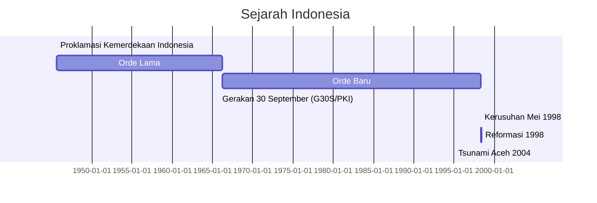

# Sejarah Indonesia

Visualisasi garis waktu peristiwa sejarah Indonesia:

```mermaid
gantt
    title Sejarah Indonesia
    dateFormat  YYYY-MM-DD
    Proklamasi Kemerdekaan Indonesia : 1945-08-17, 1d
    Orde Lama : 1945-08-18, 1966-03-11
    Orde Baru : 1966-03-11, 1998-05-21
    Gerakan 30 September (G30S/PKI) : 1965-09-30, 1965-10-01
    Kerusuhan Mei 1998 : 1998-05-12, 1998-05-15
    Reformasi 1998 : 1998-05-21, 1d
    Tsunami Aceh 2004 : 2004-12-26, 1d
```
